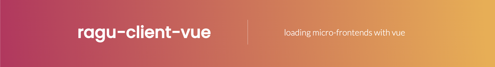

<p align="center" style="color: #343a40">
  <p align="center" >
    
  </p>
  <h1 align="center">Ragu Client Vue</h1>
</p>


A React Client for [Ragu Server - A micro-frontend framework](https://ragu-framework.github.io).

## Installation

```shell script
npm install ragu-client-vue
```

## Development notes

### Project setup
```
yarn install
yarn build
```

#### Compiles a demo using the library
```
yarn serve
```
